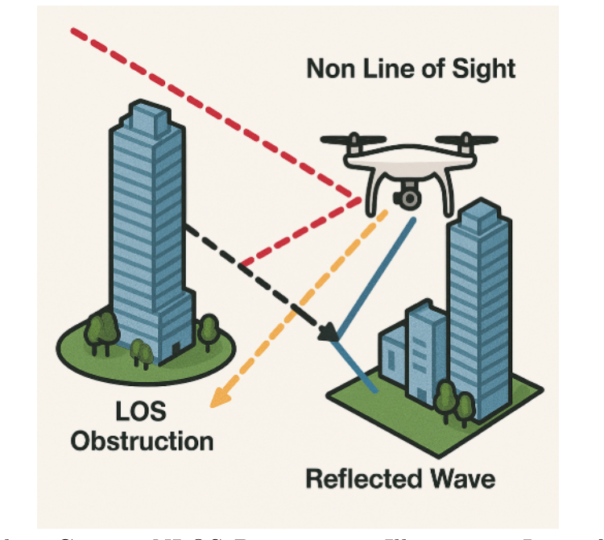
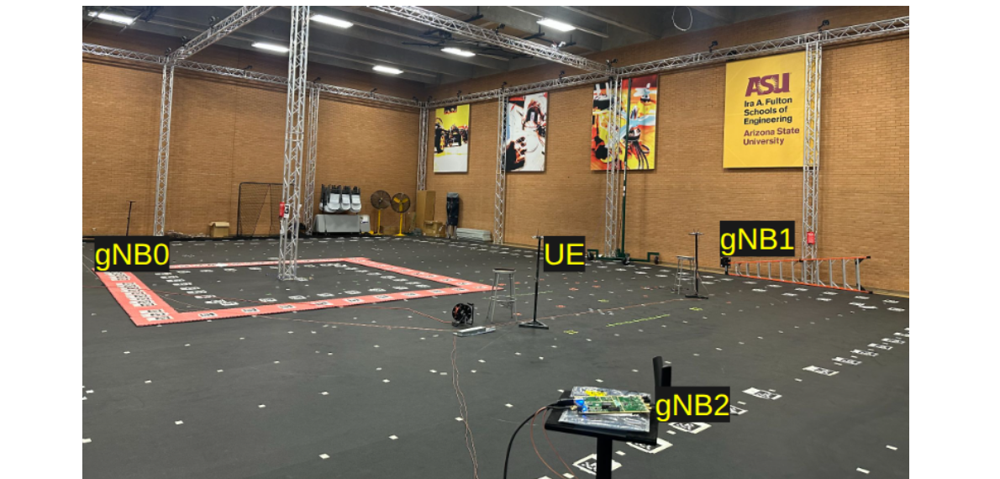
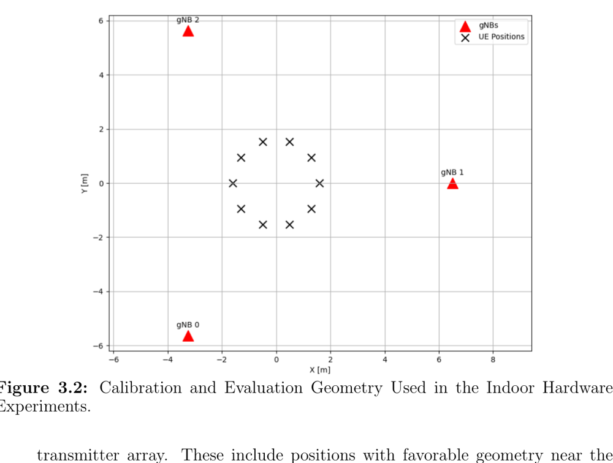

# 5G-Based UAV Localization in GNSS-Denied Indoor Environments

This repository accompanies my M.S. thesis at Arizona State University on indoor UAV localization using **5G New Radio Positioning Reference Signals (PRS)** as a substitute for unavailable GNSS. The work was sponsored by **Honeywell Aerospace Technologies** as the industry partner.

The thesis is currently **under embargo by Honeywell**, so the full implementation is not yet published here. This README provides a comprehensive overview of the problem, the system, the methods, and the headline results — the same content that is being presented at AIAA SciTech Forum 2026 and discussed in my [portfolio](https://aman-chandak.github.io/portfolio/).

> **Citation.** A. Chandak, Y. Kumar, N. Rao, D. Muirhead, W. Zhang. *"5G-based Localization for Unmanned Aerial Vehicles."* AIAA SciTech Forum, 2026.

---

## 1. Problem

UAVs increasingly need to fly in indoor facilities, warehouses, urban canyons, and disaster sites — exactly the environments where GNSS is blocked or heavily distorted. Vision and LiDAR pipelines exist but degrade in featureless corridors, glass atriums, and SWaP-limited platforms; ultra-wideband anchors give cm-level accuracy but require purpose-built infrastructure at every site.

5G New Radio offers a compelling middle ground: it reuses the cellular infrastructure that is already being deployed for connectivity, and its PRS waveforms have far wider bandwidth than legacy cellular positioning. The catch is **multipath**. The earliest detectable arrival at the receiver can be delayed by reflections and non-line-of-sight (NLOS) propagation, and a 10 ns excess delay translates into ~3 m of range error before OTDOA equations even get involved.

  
   
  <em>Figure 1 — Multipath / NLOS is the dominant source of practical ranging error in indoor and dense-urban deployments.</em>

The thesis asks: *How can 5G PRS-based OTDOA localization be made accurate and reliable enough for UAV operation in GNSS-denied indoor environments when the measured arrival times are corrupted by geometry, multipath, and detector-dependent timing bias?*

## 2. Approach

The work is split into two complementary parts:

1. **An SDR hardware testbed** that demonstrates end-to-end indoor 5G PRS localization and exposes the dominant residual error sources.
2. **A detector-aware probabilistic correction model** trained in a hardware-matched simulator that fixes per-link bias and feeds calibrated uncertainty into the OTDOA solver.

### 2.1 Hardware testbed

The testbed emulates the standardized 5G positioning split: synchronized ground transmitters broadcast PRS, a UAV-mounted receiver records I/Q samples, and OTDOA multilateration runs offline. Built around four Ettus USRP B210 software-defined radios driven by **OpenAirInterface**, with a shared 10 MHz + 1 PPS reference from an OctoClock-G distribution module.

  
   
  <em>Figure 2 — Indoor drone studio at ASU (≈12 × 12 m) with three synchronized gNB transmitters (USRP B210) and the UAV-mounted receiver.</em>

| Hardware / signal parameter | Value |
|---|---|
| SDR platform | Ettus USRP B210 |
| Number of transmitters | 3 |
| Center frequency | 3.5 GHz |
| Subcarrier spacing | 30 kHz (μ = 1) |
| Resource blocks | 106 |
| Effective signal bandwidth | 38.16 MHz |
| Receiver sample rate | 46 MHz |
| Delay resolution | ≈ 26 ns (≈ 7.8 m) |
| Synchronization | OctoClock-G (10 MHz + 1 PPS) |

The signal chain is: PRS generation (3GPP TS 38.211 via OpenAirInterface) → over-the-air propagation → I/Q capture → correlation-based ToA extraction with a top-*K* first-arriving-path consistency check → inter-gNB timing calibration on a 10-point survey circle → weighted Gauss–Newton OTDOA solve.

  
   
  <em>Figure 3 — Transmitter geometry and evaluation points. The clustered, off-center geometry stresses OTDOA where GDOP is high.</em>

**Three hardware experiments** were run on this testbed:

| Experiment | Setup | RMSE |
|---|---|---|
| Exp. 1 — Single-point baseline | Receiver at the geometric origin (best GDOP) | **1.50 m** |
| Exp. 2 — Eight-point static evaluation | Points distributed across the studio, including poor GDOP near the transmitter plane | **4.87 m** |
| Exp. 3 — Drone-mounted evaluation | UAV at ~1.5 m, off-center | **5.80 m** |

The hardware results validate that the synchronized PRS chain works end-to-end and produces meter-level accuracy at the best operating point. They also expose the bottleneck: **residual timing bias that survives even after careful calibration and first-arriving-path filtering** is the dominant remaining error source — not random noise — and it grows in geometrically challenging regions.

### 2.2 Hardware-matched simulator + learning pipeline

Because the residual bias is structured rather than random, ordinary least-squares solvers can't absorb it. The second half of the thesis builds a learning model targeted exactly at that bias.

**Simulator.** A MATLAB ray-tracing pipeline reproduces the PRS operating point, leading-edge timing extraction, bounded power-delay-profile observations, distance-dependent SNR, and random-walk receiver clock bias seen on the real hardware. The corpus contains:

- 180 simulated realizations
- 540,000 timesteps
- **2,157,161 valid PRS links** across small, base, and large indoor room regimes

Crucially, the simulator exports **detector-facing measurements** — the same view as the OpenAirInterface receiver — so the learned model trains on the same signal statistics it will see on hardware.

**Supervision target.** The common random-walk clock term is removed first, leaving a *de-clocked link bias* as the supervised target. This isolates link-specific propagation bias from receiver clock drift, and makes the learning problem environment-agnostic instead of trajectory-specific.

**Model.** Each link is summarized as a **26-dimensional detector-aware feature tensor** (path-structure statistics, SNR, normalized PDP morphology, room-normalized TRP coordinates). The tensor is passed through:

1. A **frozen severity classifier** (small MLP) that predicts whether a link is in the benign or positive-excess-bias regime.
2. A **residual MLP regressor** (192-D encoder) that consumes the feature tensor stacked with the classifier probability.
3. **Parallel probabilistic heads** — a quantile head and a Gated Mixture-of-Gaussians head — that emit a point bias correction *and* a calibrated uncertainty estimate.

**Integration.** Predicted corrections and variances are fused back into a **weighted Gauss–Newton OTDOA solver** as per-link bias terms and inverse-variance weights. A severity-aware reference-transmitter selection rule picks the most trustworthy anchor at each timestep.

## 3. Headline results

Reported on held-out environments — rooms the model never saw during training.

| Metric | Raw OTDOA baseline | Corrected pipeline (proposed) |
|---|---|---|
| Validation horizontal RMSE | **8.493 m** | **1.267 m** |
| Held-out test horizontal RMSE | **11.827 m** | **2.080 m** |
| Test improvement vs. baseline | — | **~82% error reduction** |
| Parameters vs. strongest attention-based ablation | — | **33.9% fewer**, within 0.036 m on test RMSE |

The corrected pipeline closes most of the gap between the raw indoor measurements and the **bandwidth-limited oracle bound** (the theoretical lower bound at the same detector setting). The principal unresolved weakness is uncertainty calibration under distribution shift — discussed in the thesis as future work.

## 4. Contributions

1. A validated indoor 5G PRS UAV localization testbed built on synchronized Ettus USRP B210s and OpenAirInterface, with a complete OTDOA pipeline (correlation → top-*K* FAP consistency → inter-gNB calibration → weighted Gauss–Newton).
2. A hardware-matched ray-tracing simulator that preserves the detector viewpoint of the real receiver, producing a 2.15 M-link environment-agnostic training corpus.
3. A detector-aware probabilistic correction framework — frozen severity classifier + residual MLP + quantile / gated mixture-density heads — that predicts both a per-link bias correction and a calibrated uncertainty.
4. End-to-end integration of the learned predictions into a weighted Gauss–Newton OTDOA solver, with severity-aware reference-transmitter selection.
5. A four-variant comparative ablation showing that the proposed compact model matches the strongest attention-based alternative while using 33.9% fewer trainable parameters.

## 5. Repository status

| Component | Status |
|---|---|
| Hardware-testbed processing scripts (OAI capture → ToA → OTDOA solve) | **Embargoed** — will be released after the Honeywell sponsorship period ends. |
| Ray-tracing simulator + 2.15 M-link corpus | **Embargoed** |
| Detector-aware bias-correction model (training + inference) | **Embargoed** |
| AIAA SciTech 2026 paper | Will be linked here on publication. |
| Thesis (ProQuest) | [ProQuest 3335497868](https://www.proquest.com/docview/3335497868) |

If you are interested in collaboration, citations, or deeper technical discussion of the methods, please reach out by email.

## 6. Acknowledgments

- **Dr. Wenlong Zhang** (committee chair) for guidance throughout this project.
- **Dr. Spring Berman** and **Dr. Nayyar Rao** for serving on the supervisory committee.
- **Yogesh Kumar** and **Dr. Karshima Patnaik** for invaluable contributions to the SDR testbed and drone-studio experiments.
- **Honeywell Aerospace Technologies** for funding, hardware testbed support, and continuous technical engagement.
- **RISE Lab, Arizona State University** for the indoor drone studio and lab infrastructure.

## Author

**Aman Chandak** — M.S. Robotics and Autonomous Systems, Arizona State University.
[Portfolio](https://aman-chandak.github.io/portfolio/) · [LinkedIn](https://www.linkedin.com/in/aman-chandak-9094b5131/) · achan160@asu.edu
